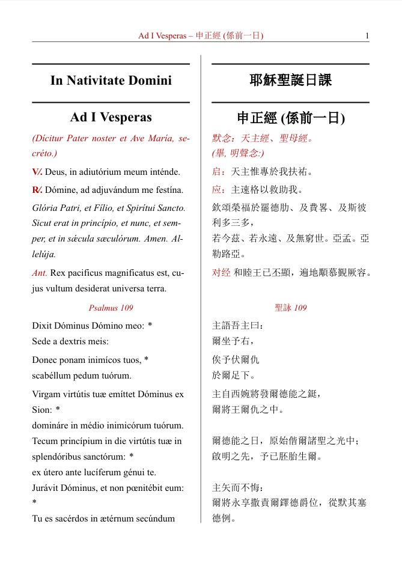

# Breviarium Auto-Formatting Tool (Prototype / 试作版)

> **Note / 注意**: This is an experimental release. Currently only supports **Windows**.
> 这是一个试验性版本，目前仅支持 **Windows** 系统。

## 效果预览 (Preview)

下图是软件生成的排版效果截图示例。

> **提示 / Tip**:
> 图中效果对应的中间 LaTeX 代码文件已包含在仓库中examples文件夹供参考。
> 您可以在这里查看：[examples/sample_body.tex](examples/sample_body.tex)
>
> The intermediate LaTeX code corresponding to the preview above is available for reference here: [examples/sample_body.tex](examples/sample_body.tex)

---

## 中文说明

这是自动日课排版软件的**试作版本**。旨在通过 Python 脚本自动化处理 LaTeX 排版流程，帮助用户快速生成格式规范的日课（Breviarium）文档。

### 前置要求 (必读)
本程序仅包含排版逻辑，**不包含 LaTeX 编译环境**。在使用本软件前，你的电脑必须安装 LaTeX 发行版：
* **如何安装**: 请访问 [TeX Live 官网](https://tug.org/texlive/acquire-netinstall.html) 下载 `install-tl-windows.exe` 并安装。
* *建议安装完整版 (Full installation) 以免缺少必要的宏包。*

### 如何使用
1.  **下载与解压**: 在 Releases 页面下载最新的压缩包，将其**完整解压**到一个文件夹中（请勿将 `.exe` 单独移出，它依赖同目录下的资源文件）。
2.  **自定义内容**:
    * `content/` 文件夹：在其中放入你的文本内容。
    * `images/` 文件夹：在其中放入需要用到的插图。
3.  **运行程序**: 双击运行目录下的 `.exe` 文件。
4.  **获取结果**: 程序运行结束后，生成的 PDF 文件会自动保存在 `Output` 文件夹中。

### 关于文本内容的说明
`content` 文件夹内目前的文本仅为**试运行版本**，其中尚存在诸多错误和待校对之处。后续版本会逐步更新修正。如果急需使用，您可以参考现有的格式，自行修改其中的 `.txt` 文件内容。

### 进阶开发
如果你需要修改 `body.tex` 模板，或者希望分别运行流程中的独立脚本（而非打包版），请访问本仓库的 [**Branches (分支)**](https://github.com/Clemensdsh/Breviarium-auto-formatting/branches) 页面切换到 `modular-scripts` 或其他分支下载对应的源码版本。

### 免责声明
* **杀毒软件误报**: 由于本程序未进行数字签名，Windows Defender 或其他杀毒软件可能会误报。这是 Python 打包程序的常见问题，请选择“允许运行”。
* **数据备份**: 运行前建议备份您的 `content` 文件。

---

## English Description

This is a **prototype** of the automated Breviary typesetting software. It utilizes Python scripts to streamline the LaTeX typesetting process, allowing users to generate formatted Breviarium documents efficiently.

### Prerequisites (Important)
This software handles the logic but **does not include the LaTeX compiler**. You must have a LaTeX distribution installed on your system:
* **Installation**: Please visit [TeX Live](https://tug.org/texlive/acquire-netinstall.html) to download and install `install-tl-windows.exe`.
* *A full installation is recommended to ensure all necessary packages are available.*

### Usage
1.  **Download & Unzip**: Download the latest zip file from the Releases page and **extract all contents** to a single folder. (Do not move the `.exe` file separately as it depends on the surrounding files).
2.  **Customize**:
    * `content/`: Place your text files here.
    * `images/`: Place your illustrations here.
3.  **Run**: Double-click the `.exe` file to start the process.
4.  **Output**: Once finished, the generated PDF will be saved in the `Output` folder.

### Note on Text Content
The text files currently provided in the `content` folder are for **trial purposes only** and contain errors/issues. Future updates are planned to correct these. If you have immediate needs, you may manually modify the `.txt` files following the existing format.

### Advanced Use
If you wish to customize the `body.tex` template or run specific modular scripts individually (instead of the unified executable), please check the [**Branches**](https://github.com/Clemensdsh/Breviarium-auto-formatting/branches) of this repository (e.g., `modular-scripts`) to download the source code.

### Disclaimer
* **Antivirus Warning**: As this software is not digitally signed, Windows Defender or other antivirus software might flag it. This is a common issue for Python-compiled executables. You may need to "Run anyway" or add it to the exclusion list.
* **Backup**: Please backup your `content` files before running.

---

## 致谢 / Credits

特别感谢 **Gabriel 仁昆** 给予的灵感。同时感谢 **AlanL399** 在 GitHub 上的日课编排项目，其 LaTeX 源文本在格式编排方面提供了极好的指南（虽然在代码写完后我才发现，已来不及（懒得）修改）。如此阳春白雪却少有问津，特此指路：[BreviaryTypesetting](https://github.com/AlanL399/BreviaryTypesetting)。

最后，感谢 **Claude** 和 **Gemini** 两位 AI 助手在代码编写与调试过程中提供的巨大帮助。

Special thanks to **Brother Gabriel Renkun** for the inspiration. I also want to acknowledge **AlanL399** and his Breviary Typesetting project on GitHub. His LaTeX source text provided valuable formatting guidelines—even though I discovered it only after finishing my code (too late to refactor this time), it was remarkably insightful. It is a hidden gem that surprisingly lacks stars, check it out here: [BreviaryTypesetting](https://github.com/AlanL399/BreviaryTypesetting).

Finally, thanks to **Claude** and **Gemini**, my AI assistants, for their immense help in coding and debugging.
