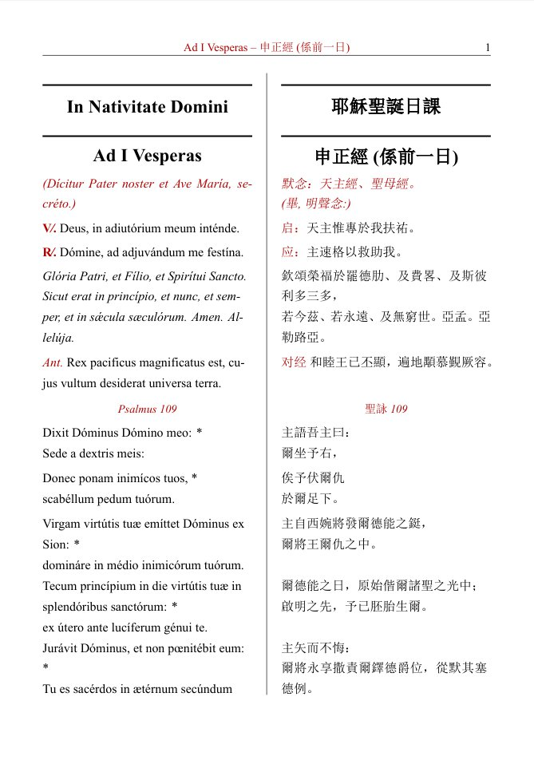

# Breviarium Auto-Formatting / 日课经自动排版工具

<p align="center">
  
</p>

A LaTeX-based tool for typesetting the Roman Breviary with parallel Latin-Chinese text.

基于 LaTeX 的罗马日课排版工具，支持拉丁文-中文双栏对照。

本项目LaTeX逻辑的早期成果见 
https://clemensdsh.github.io/2025/12/23/pdftest/ 
（羅馬大日課-耶穌聖誕瞻禮（中拉對照））

---

## ✝️ Features / 功能特点

| English | 中文 |
|---------|------|
| Dual-column Latin-Chinese parallel layout | 拉丁文-中文双栏对照排版 |
| Liturgical red rubrics | 礼仪红字（rubrics）支持 |
| Gregorio chant notation support | Gregorio 格里高利圣咏乐谱支持 |
| Auto-generated table of contents | 自动生成目录 |
| A5 paper, print-ready output | A5 纸张，可直接印刷 |
| GUI application (Windows) | 图形界面应用（Windows） |

---

## 📦 Installation / 安装

### Option 1: Download EXE / 方式一：下载可执行文件

Download the latest `BreviariumGen.exe` from [Releases](../../releases).

从 [Releases](../../releases) 下载最新的 `BreviariumGen.exe`。

**Requirements / 系统要求:**
- Windows 10/11
- TeX Live or MiKTeX with LuaLaTeX
- TeX Live 或 MiKTeX（需包含 LuaLaTeX）

### Option 2: Manual LaTeX / 方式二：手动 LaTeX 编译

You can use the LaTeX files directly without the GUI:

也可以直接使用 LaTeX 文件，无需图形界面：

```
your_project/
├── main.tex          # Main document / 主文档
├── psalter.sty       # Style package / 样式包
├── body.tex          # Your content / 你的内容
├── images/           # Images folder / 图片文件夹
│   └── *.jpg, *.png
└── gabc/             # Gregorian chant files / 圣咏乐谱文件夹
    └── *.gabc
```

Compile with / 编译命令:
```bash
lualatex main.tex
```

> ⚠️ **Must use LuaLaTeX!** XeLaTeX and pdfLaTeX are not supported.
> 
> ⚠️ **必须使用 LuaLaTeX！** 不支持 XeLaTeX 和 pdfLaTeX。

---

## 📖 Usage / 使用方法

### GUI Application / 图形界面

1. Run `BreviariumGen.exe` / 运行 `BreviariumGen.exe`
2. Add psalms, hymns, and other elements / 添加圣咏、圣歌等元素
3. Click "Compile" to generate PDF / 点击"编译"生成 PDF

### Manual Editing / 手动编辑

Edit `body.tex` using the commands provided by `psalter.sty`:

使用 `psalter.sty` 提供的命令编辑 `body.tex`：

```latex
\begin{paracol}{2}

% Header / 标题
\psHeaderOneCap{In Nativitate Domini}{耶稣圣诞日课}

% Antiphon / 对经
\psAntiphonRepeat{Rex pacificus...}{和睦王已丕显...}

% Psalm title / 圣咏标题
\psPsalmTitle{Psalmus 109}{圣咏109}

% Verses / 诗节
\psVerse{Dixit Dóminus Dómino meo...}{主语吾主曰...}

% Gloria Patri / 圣三光荣颂
\psGloria{Glória Patri...}{钦颂荣福...}

% Hymn / 圣歌
\psHymnHeader{Jesu, Redémptor ómnium}{救世耶稣}
\psHymnStanza{Jesu, Redémptor...}{救世耶稣...}

% Rubrics / 红字指示
\psRubric{(Dícitur Pater noster...)}{默念：天主经...}

% Versicle & Response / 对唱
\psVR{V}{Deus, in adiutórium...}{天主惟专于我扶佑。}
\psVR{R}{Dómine, ad adjuvándum...}{主速格以救助我。}

\end{paracol}
```

---

## 🎵 Gregorian Chant / 格里高利圣咏

Place `.gabc` files in the `gabc/` folder and include them:

将 `.gabc` 文件放入 `gabc/` 文件夹，然后引用：

```latex
\gregorioscore{gabc/your_chant.gabc}
```

> Requires GregorioTeX installed in your TeX distribution.
> 
> 需要在 TeX 发行版中安装 GregorioTeX。

---

## 🖼️ Images / 图片

Place images in the `images/` folder:

将图片放入 `images/` 文件夹：

```latex
% Normal image / 普通图片
\psImage{images/your_image.jpg}

% Full-width image / 全宽图片
\psImageFullWidth{images/your_image.jpg}
```

---

## 📋 Available Commands / 可用命令

| Command / 命令 | Description / 说明 |
|----------------|-------------------|
| `\psHeaderOneCap{lat}{chn}` | Large header (uppercase) / 大标题（大写） |
| `\psHeaderOneLowercase{lat}{chn}` | Large header (lowercase) / 大标题（小写） |
| `\psHeaderTwo{lat}{chn}` | Medium header / 中标题 |
| `\psHeaderThree{lat}{chn}` | Small header / 小标题 |
| `\psPsalmTitle{lat}{chn}` | Psalm title / 圣咏标题 |
| `\psVerse{lat}{chn}` | Psalm verse / 诗节 |
| `\psVerseDropcap{lat}{chn}` | Verse with drop cap / 首字下沉诗节 |
| `\psAntiphonRepeat{lat}{chn}` | Antiphon / 对经 |
| `\psGloria{lat}{chn}` | Gloria Patri / 圣三光荣颂 |
| `\psHymnHeader{lat}{chn}` | Hymn title / 圣歌标题 |
| `\psHymnStanza{lat}{chn}` | Hymn stanza / 圣歌段落 |
| `\psRubric{lat}{chn}` | Rubric (red text) / 红字指示 |
| `\psVR{V/R}{lat}{chn}` | Versicle/Response / 对唱 |
| `\psCollect{lat}{chn}` | Collect prayer / 集祷经 |
| `\psText{lat}{chn}` | Plain text / 普通文本 |
| `\psLesson{lat}{chn}` | Lesson / 读经 |
| `\psCapit{lat}{chn}` | Capitulum / 短读经 |
| `\gregorioscore{file}` | Gregorian chant / 格里高利圣咏 |
| `\psImage{file}` | Image / 图片 |
| `\psPageBreak` | Page break / 分页 |
| `\psThinRule` | Thin separator line / 细分隔线 |
| `\psThickRule` | Thick separator line / 粗分隔线 |

---

## 🛠️ Building from Source / 从源码构建

```bash
# Clone repository / 克隆仓库
git clone https://github.com/Clemensdsh/Breviarium-auto-formatting.git
cd Breviarium-auto-formatting

# Install dependencies / 安装依赖
pip install pyinstaller

# Build EXE / 构建可执行文件
pyinstaller BreviariumGen.spec
```

The executable will be in `dist/BreviariumGen.exe`.

可执行文件将生成在 `dist/BreviariumGen.exe`。

---

## 📁 Project Structure / 项目结构

```
Breviarium-auto-formatting/
├── main.py                 # GUI entry point / 图形界面入口
├── main.tex                # LaTeX main document / LaTeX 主文档
├── psalter.sty             # LaTeX style package / LaTeX 样式包
├── BreviariumGen.spec      # PyInstaller config / PyInstaller 配置
├── psalter_generator/      # Python GUI modules / Python 图形界面模块
├── content/                # Built-in content / 内置内容
│   ├── psalms/             # Psalms / 圣咏
│   ├── canticles/          # Canticles / 圣歌
│   └── ...
├── gabc/                   # Gregorian chant files / 圣咏乐谱
├── images/                 # Image resources / 图片资源
└── examples/               # Example files / 示例文件
```

---

## 📜 License / 许可证

This project is for liturgical and educational use.

本项目供礼仪和教育用途使用。

---

## 🙏 Acknowledgments / 致谢

- [GregorioTeX](https://gregorio-project.github.io/) - Gregorian chant typesetting / 格里高利圣咏排版
- [LuaTeX](http://www.luatex.org/) - TeX engine / TeX 引擎
- [luatexja](https://github.com/luatexja/luatexja) - Japanese/Chinese typesetting / 中日文排版

---

<p align="center">
  ☩ A.M.D.G. ☩
</p>
